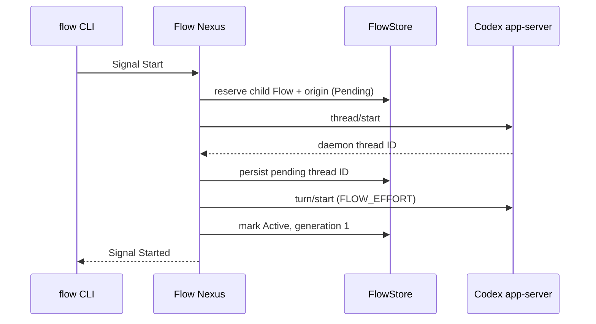

# Flow Nexus design

The ordinary and meta sockets are separate Signal edges. Text ends at a CLI:
the client turns one inline Datom into a typed request, sends an rkyv frame,
and textualizes the typed reply as Datom. The standalone `signal-flow` repo
owns `Start`, `Restart`, `ResolveRecipient`, `Send`, `Stop`, and `List`;
`meta-signal-flow` owns `Configure` and `ConsumeReset`. Each contract versions
its own wire.
`RunningNexus` dispatches; `FlowStore` owns working state and policy.

The launch brief and the Codex thread environment give the child its allocated
`FLOW_ID` and `FLOW_DIRECTORY`, then record parent Flow, source session, and
source turn as the child’s context clue. Origin does not grant authority. A
restart is authorized only when the supplied Flow ID and harness session equal
the target's registered identity. The store returns that child’s saved daemon
thread ID; the adapter resumes it; generation changes only after the resume
turn succeeds.

If `thread/start` succeeds but the first turn fails, a durable Pending record
keeps the known thread. A later child-self restart resumes it rather than
launching a second thread. A thread-start failure leaves a non-resumable
pending reservation. Both conditions recover from `FLOW_NEXUS_STORE`.

`ResolveRecipient` projects a durable Flow record into a `FlowNode`: Flow ID,
daemon session ID, harness kind, route readiness, endpoint, origin clue, and
lifecycle. Message Nexus consumes that typed reply instead of maintaining a
second identity registry.

`Send` and `Stop` act only on a route that still matches the native Herdr
snapshot. Send can promote a Pending row only after the exact idle target pane
renders a unique marker, an explicit pane read contains that marker, and a
post-read route check still matches the bound terminal. The resulting receipt
records the pane, marker, and read time as Presented grade; it does not claim
the separate Read grade. Stop
changes the durable lifecycle only after the exact pane closes successfully.
`List` reads the same store rows and sorts them by Flow ID; it does not infer
state from the current Herdr roster.

`RegisterFlow` is a meta Signal for importing sessions created before Flow
Nexus. It preserves the same `FlowNode` shape used by resolution, so imported
and Nexus-launched identities share one registry and one read contract.
For Claude records, the stored endpoint is only a candidate: every resolution
revalidates the full session against `state.json`, the daemon roster,
rendezvous and control sockets, process liveness, permission fields, and
terminal lifecycle states before returning `Ready`.

Fresh stores persist default sockets. Meta `Configure` writes the same store
and reports `NexusRestartRequired`, since rebinding live sockets is deferred
to a Nexus restart. The adapter is outside the Signal wire boundary: the
Codex app-server conversation is WebSocket/JSON-RPC through the configured
control socket. `ConsumeReset` uses the same adapter but is reachable only
through the meta socket. Both sockets are owner-only (`0600`); this separates
administrative protocol surface from the ordinary surface inside one Unix
account and does not distinguish processes with the same UID. Reset callers
supply the idempotency key so retries reuse it. Protocol tests cover framing, refusal, timeout,
assigned-flow context, and the reset outcome mapping.
