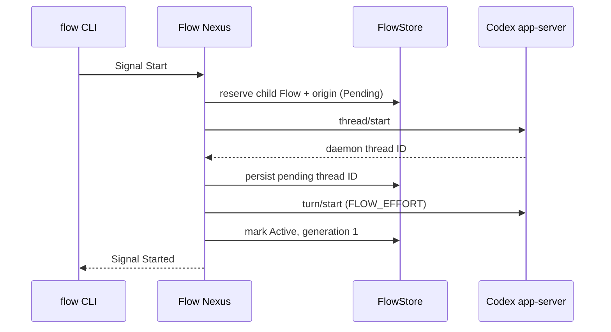

# Flow Nexus design

The ordinary and meta sockets are separate Signal edges. Datom ends at a CLI:
the client parses text, sends an rkyv frame, and later textualizes the typed
reply. `signal-flow` owns `Start` and `Restart`; `meta-signal-flow` owns
`Configure`. Each contract owns its `WIRE_VERSION`. `RunningNexus` dispatches;
`FlowStore` owns working state and policy in `FLOW_NEXUS_STORE`.

The launch brief gives the child its allocated `FLOW_ID` and
`FLOW_DIRECTORY`, then records parent Flow, source session, and source turn as
the child’s context clue. Origin does not grant authority. A restart is authorized only when
the supplied authority equals the target child Flow ID. The store returns that
child’s saved daemon thread ID; the adapter resumes it; generation changes
only after the resume turn succeeds.

If `thread/start` succeeds but the first turn fails, a durable Pending record
keeps the known thread. A later child-self restart resumes it rather than
launching a second thread. A thread-start failure leaves a non-resumable
pending reservation. Both conditions recover from `FLOW_NEXUS_STORE`.

Fresh stores persist default sockets. Meta `Configure` writes the same store
and reports `NexusRestartRequired`, since rebinding live sockets is deferred
to a Nexus restart. The adapter is outside the Signal wire boundary: the
Codex app-server conversation is WebSocket/JSON-RPC through
`CODEX_APP_SERVER_SOCKET`. Its protocol tests cover framing, refusal, timeout, and the assigned-flow
brief. A live smoke created a daemon-owned, list-visible `gpt-5.6-terra`
thread at `medium`; its bounded turn completed with `FLOW_SMOKE_OK`. Earlier
pre-fix `gpt-5.4` threads failed because that model is unavailable to this
ChatGPT account.
