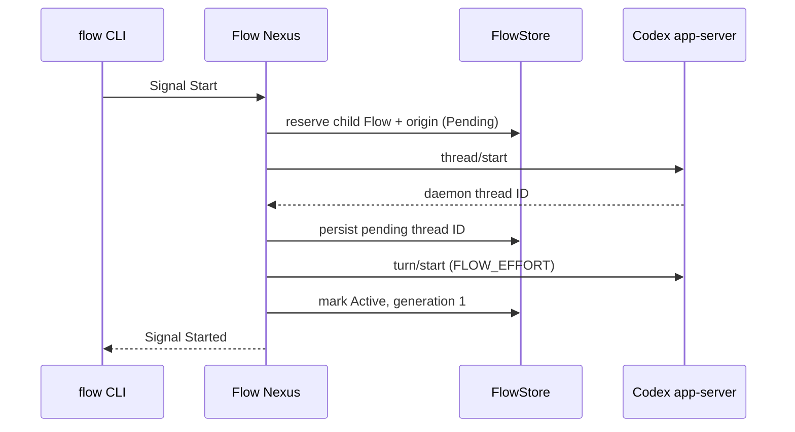

# Flow Nexus design

The ordinary and meta sockets are separate Signal edges. Text ends at a CLI:
the client turns a short command into a typed request, sends an rkyv frame,
and textualizes the typed reply as Datom. The standalone `signal-flow` repo
owns `Start`, `Restart`, and `ResolveRecipient`; `meta-signal-flow` owns
`Configure` and `ConsumeReset`. Each contract versions its own wire.
`RunningNexus` dispatches; `FlowStore` owns working state and policy.

The launch brief gives the child its allocated `FLOW_ID` and
`FLOW_DIRECTORY`, then records parent Flow, source session, and source turn as
the child’s context clue. Origin does not grant authority. A restart is authorized only when
the supplied authority equals the target child Flow ID. The store returns that
child’s saved daemon thread ID; the adapter resumes it; generation changes
only after the resume turn succeeds.

If `thread/start` succeeds but the first turn fails, a durable Pending record
keeps the known thread. A later child-self restart resumes it rather than
launching a second thread. A thread-start failure leaves a non-resumable
pending reservation. Both conditions recover from `FLOW_NEXUS_STORE`.

`ResolveRecipient` projects a durable Flow record into a `FlowNode`: Flow ID,
daemon session ID, harness kind, route readiness, endpoint, origin clue, and
lifecycle. Message Nexus consumes that typed reply instead of maintaining a
second identity registry.

Fresh stores persist default sockets. Meta `Configure` writes the same store
and reports `NexusRestartRequired`, since rebinding live sockets is deferred
to a Nexus restart. The adapter is outside the Signal wire boundary: the
Codex app-server conversation is WebSocket/JSON-RPC through the configured
control socket. `ConsumeReset` uses the same adapter but is reachable only
through the meta socket. Protocol tests cover framing, refusal, timeout,
assigned-flow context, and the reset outcome mapping.
