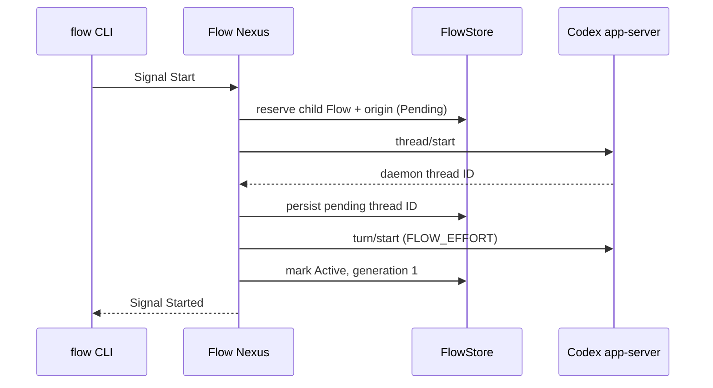

# Flow Nexus design

The ordinary and meta sockets are separate Signal edges. Text ends at a CLI:
the client turns one inline Datom into a typed request, sends an rkyv frame,
and textualizes the typed reply as Datom. The standalone `signal-flow` repo
owns `Start`, `Restart`, `ResolveRecipient`, `Send`, `Stop`, `List`,
`Replace`, `LaunchStatus`, and `Observe`;
`meta-signal-flow` owns `Configure` and `ConsumeReset`. Each contract versions
its own wire.
`RunningNexus` dispatches; `FlowStore` owns working state and policy.

The launch brief and the Codex thread environment give the child its allocated
`FLOW_ID` and `FLOW_DIRECTORY`, then record parent Flow, source session, and
source turn as the child’s context clue. Origin does not grant authority. A
restart is authorized only when the supplied Flow ID and harness session equal
the target's registered identity. The store returns that child’s saved daemon
thread ID; the adapter resumes it; generation changes only after the resume
turn succeeds.

If `thread/start` succeeds but the first turn fails, a durable Pending record
keeps the known thread. A later child-self restart resumes it rather than
launching a second thread. A thread-start failure leaves a non-resumable
pending reservation. Both conditions recover from `FLOW_NEXUS_STORE`.

`ResolveRecipient` projects a durable Flow record into a `FlowNode`: Flow ID,
daemon session ID, harness kind, route readiness, endpoint, origin clue, and
lifecycle. Message Nexus consumes that typed reply instead of maintaining a
second identity registry.

`Send` and `Stop` act only on a route that still matches the native Herdr
snapshot. A route is keyed on what Herdr binds for the pane's life: session,
pane id and terminal id, with the harness kind. The agent name is a label a
running flow may change; it is re-read from the snapshot and reported, never
matched. Send types the bare input and nothing else. Its grades are exact:
`NotDelivered` (nothing typed), `Accepted` (queued to a working agent),
`Presented` (a settled agent observed reacting on the exact pane, the route
still matching afterward) and `Uncertain` (typed, reaction unobserved). A
Pending row is promoted only by a Presented Send; no probe or marker is ever
typed to promote it. Presented does not claim the separate Read grade. Stop
changes the durable lifecycle only after the exact pane closes successfully.
`List` reads the same store rows and sorts them by Flow ID; it does not infer
state from the current Herdr roster.

`Replace` carries a `StartRequest` whose profile names the predecessor. The
successor launches through the one Start path; on `Started` the predecessor is
recorded `Stopped` (so `ResolveRecipient` and `Send` refuse it), then its
exact pane is closed, and only the `Replaced` outcome releases the successor
to routing. Until then the successor is held: `ResolveRecipient` answers
`FlowUnavailable` and `Send` answers `RouteUnavailable`. A predecessor whose
pane a readable Herdr snapshot shows absent is already reaped: it is recorded
`Stopped`, nothing is closed, and `Replaced` releases the successor. When Herdr
cannot be read, or shows the pane under another binding, the pane may still be
open: that is `ReplaceRejected.ReapRefused.RouteUnavailable`, nothing is
closed, and the successor stays held. A close that fails on a pane that exists
is `ReplaceRejected.ReapRefused.CloseRefused`. Either refusal leaves neither
flow routable, and a repeated `Replace` of the same request takes the reap up
again.

Every launch request settles into one stored outcome — `Started`, `Replaced`,
`StartRejected`, or `ReplaceRejected` — once an attempt was reserved for it.
`LaunchStatus` answers that outcome, else `LaunchPending` with the attempt and
its phase, without waiting behind a running launch. `Observe.Launch` keeps its
connection as the subscription: the current answer on open, one
`LaunchPending` frame per phase change, the outcome last, then the Nexus
closes the exchange. Phase changes are announced by the store; a launch
waiting on its first prompt is moved by a file-change watch on its native
transcript root, which promotes it under the dispatch gate. The Nexus holds
that watch itself for every ambiguous launch, from startup on, so a receipt
that lands after `StartAmbiguous` promotes with no subscriber and no second
Start. Nothing re-reads on a timer.

`RegisterFlow` is a meta Signal for importing sessions created before Flow
Nexus. It preserves the same `FlowNode` shape used by resolution, so imported
and Nexus-launched identities share one registry and one read contract.
For Claude records, the stored endpoint is only a candidate: every resolution
revalidates the full session against `state.json`, the daemon roster,
rendezvous and control sockets, process liveness, permission fields, and
terminal lifecycle states before returning `Ready`.

Fresh stores persist default sockets, source root, and Codex endpoints. Meta
`Configure` carries all of them, writes the same store, and reports
`NexusRestartRequired`, since rebinding live sockets and adapters is deferred
to a Nexus restart. The deployment's `FLOW_SOURCE_ROOT` and `FLOW_CODEX_*`
overrides are still laid over the stored runtime values at start. The adapter is outside the Signal wire boundary: the
Codex app-server conversation is WebSocket/JSON-RPC through the configured
control socket. `ConsumeReset` uses the same adapter but is reachable only
through the meta socket. Both sockets are owner-only (`0600`); this separates
administrative protocol surface from the ordinary surface inside one Unix
account and does not distinguish processes with the same UID. Reset callers
supply the idempotency key so retries reuse it. Protocol tests cover framing, refusal, timeout,
assigned-flow context, and the reset outcome mapping.
